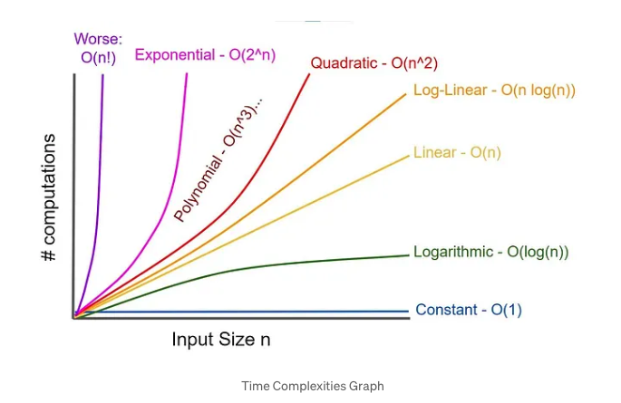
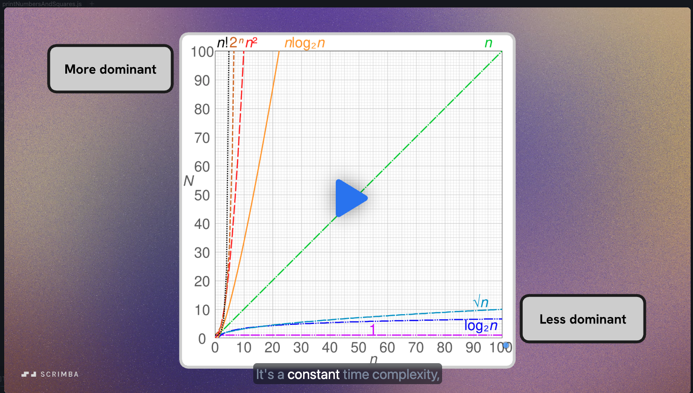

# data-structures-and-algorithms

Scrimba course: https://scrimba.com/data-structures-and-algorithms-c0shn6ckdm

# Introduction

- Data structures: Structures to orgnanize and process data
- Algorithms: Instructions to process data

_Why study DSA (Data Structures & Algorithms)?_

1. To learn the tools for efficient problem solving
2. To understand your tools
3. To prep for coding interviews

# Big O Notation

A way to describe how fast an algorithm runs in relation to the input.

- O(n) e.g. a for loop
- O(n^2) e.g. nested for loop

Assuming **1 operation = 1 second**, here’s a table with time in seconds:

|         n | O(n) time (seconds) | O(n²) time (seconds) |
| --------: | ------------------: | -------------------: |
|        10 |                10 s |                100 s |
|        50 |                50 s |              2,500 s |
|       100 |               100 s |            ~ 3 hours |
|     1,000 |        ~ 17 minutes |            ~ 12 days |
| 1,000,000 |            ~12 days |       ~ 31,710 years |

That’s the real cost of quadratic growth, and we can clearly see the efficiency impact.

## Constant time = O(1)

This is the most efficient type of algorithm. It means regardless of the input the output execution is always the time.

For example:

```js
const printInput = (n) => {
  console.log(`There are ${n} dinosaurs`);
};

//These will take the same amount of time to print:
printInput(3);
printInput(1000);
```

## Time Complexity

In theoretical computer science, the time complexity is the computational complexity that describes `the amount of computer time it takes to run an algorithm`.



### Challenge

Analyze the time complexity of the following 4 functions. For each function, just write down its time complexity in terms of Big O notation. In other words, answer the question: Is it an O(n), O(n^2), or O(1) algorithm?

```js
function sum(n) {
  let sum = 0;
  for (let num = 1; num <= n; num++) {
    sum += num;
  }
  return sum;
}

// Time complexity: O(n) - we have a function that takes in a param and iterates over that param once. (Linear)

function printMultiplicationTable(n) {
  for (let a = 0; a <= n; a++) {
    for (let b = 0; b <= n; b++) {
      console.log(`${a} x ${b} = ${a * b}`);
    }
  }
}
// Time complexity: O(n^2) - we have a function that takes in a param and iterates over that param twice (Quadratic)

function isPositive(n) {
  return n > 0;
}
// Time complexity: O(1) - the execution of this function is the same regardless of the input param. Will always take the same amount of time (Constant)

function printTriangle() {
  for (let row = 1; row <= 5; row++) {
    let line = "";
    for (let col = 1; col <= row; col++) {
      line = line + "*";
    }
    console.log(line);
  }
}
// Time complexity: O(1) - sneaky one but because this doesn't take in a param it is constant whenever executed. This is because the execution is constant, it always iterates 5 times.

// console.log(sum(100))
// printMultiplicationTable(10)
// console.log(isPositive(100))
printTriangle();
```

## Space Complexity

The `amount of memory space an algorithm uses during execution in relation to the input`.

To improve the performance of code we need to determine how `fast it runs` and how much `memory it uses`.

In the following example, to calculate the space complexity, we go line by line and determine the execution requirements.

```js
function sumSquares(n) {
  const squares = []; // O(1)
  for (let i = 1; i <= n; i++) {
    // O(1) - note that running a for loop is not O(n), it it interacting with the output (array in this case) that makes it O(n)
    squares.push(i * i);
  }
  // O(n) - for the forloop execution
  let sum = 0; // O(1)
  for (const square of squares) {
    // O(1)
    sum += square;
  }
  return sum;
}

// Space complexity = we then add up all the lines: O(1 + 1 + n + 1 + 1) = which is then O(n) which is the highest
```

To optimise the space complexity of this method from O(n) to O(1) we can simply remove the array:

```js
function sumSquares(n) {
  let sum = 0; // O(1)
  for (let i = 1; i <= n; i++) {
    // O(1)
    sum += i * i;
  }
  return sum;
}

// Space complexity: O(1)
```

## Big O simplification rules

1. Drop the constant multipliers

In the following we have a time complexity of O(2n), this is because each forloop is O(n), then we SUM the individual times to the outcome.

THEN, we can drop the constant multiplier, in this case 2 to make the time complexity output O(n). Why can we drop the 2 here?
This is because both O(2n) and O(n) fall into an O(n) class of complexity.

```jsx
function printNumbersAndSquares(n) {
  for (let i = 1; i <= n; i++) {
    console.log(i);
  }
  // O(n)
  for (let i = 1; i <= n; i++) {
    console.log(i * i);
  }
  // O(n)
}

// Time complexity: O(n + n) = O(2n) = O(n)
```

2. Drop the non-dominant terms

In the following image, we can see we have these concepts of `More dominant` and `Less dominant`:



Dominant means that it matters _more_ in the analysis.

For example, if we calculate that we have the following in our code: O(n^2) + O(n) + (O1) we could then infer we have the following addition:

O(n^2 + n + 1)

Then with the 'drop the non-dominant terms' rule, we simplify this to O(n^2). And remove the less dominant n + 1.

### Challenge

Use the Big O simplification rules to simplify the following:

1. O(3n): O(n) = Drop the constant multipliers
2. O(n^2 + 1) = O(n^2) = Drop the non-dominant terms
3. O(2n^2 + n) = O(n^2) = Drop the constant multipliers AND Drop the non-dominant terms
4. O(3n + log(n)) = O(n) = Drop the constant multipliers AND Drop the non-dominant terms
