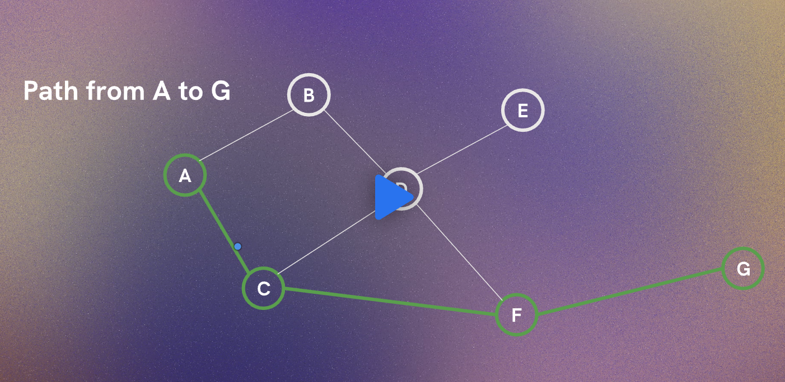

# data-structures-and-algorithms

Scrimba course: https://scrimba.com/data-structures-and-algorithms-c0shn6ckdm

# Graphs

`Linked lists` and `trees` can be modeled as specialized forms of graphs.

Examples:

- Linked list = graph where each node typically has at most one next node
- Tree = connected acyclic graph

A graph consists of:

- Vertices = nodes/points in the graph _Node and vertex are often used interchangeably_
- Edges = connections between vertices
- Neighbours = adjacent vertices directly connected by an edge
- Paths = a route through one or more edges connecting vertices

Edge: A → B
Path: A → B → C → D

## Graph properties:

- Degree: number of edges connected to a vertex E.g. if a vertex has 2 paths travelling out/to it = 2 degrees.
- In a directed graph:
- In-degree = incoming edges
- Out-degree = outgoing edges

## Types of graphs

`Directed` Graph (Digraph): edges point from one vertex to another ergo (A)----->(B)

`Undirected` graph is when there is no defined direction of the edges ergo (A)-------(B)

`Weighted` graphs have values on the edges that represent different things in the world such as the distance beteen them, or the cost of a flight connection, the time it would take to travel.

`Unweighted` graphs _don't_ have values on the paths.

A `path` can travel across multiple vertices:

And here is a summary of a `graph adjacency list`:

## Important concepts

- Cycle: a path that starts and ends at the same vertex
- Acyclic Graph: graph with no cycles
- Connected Graph: every vertex is reachable from every other vertex
- DAG (Directed Acyclic Graph): directed graph with no cycles

## Engineering perspective

As a software engineer, graphs show up everywhere:

- social networks
- GPS routing
- dependency resolution
- recommendation systems
- file systems
- workflow engines
- CI/CD pipelines
