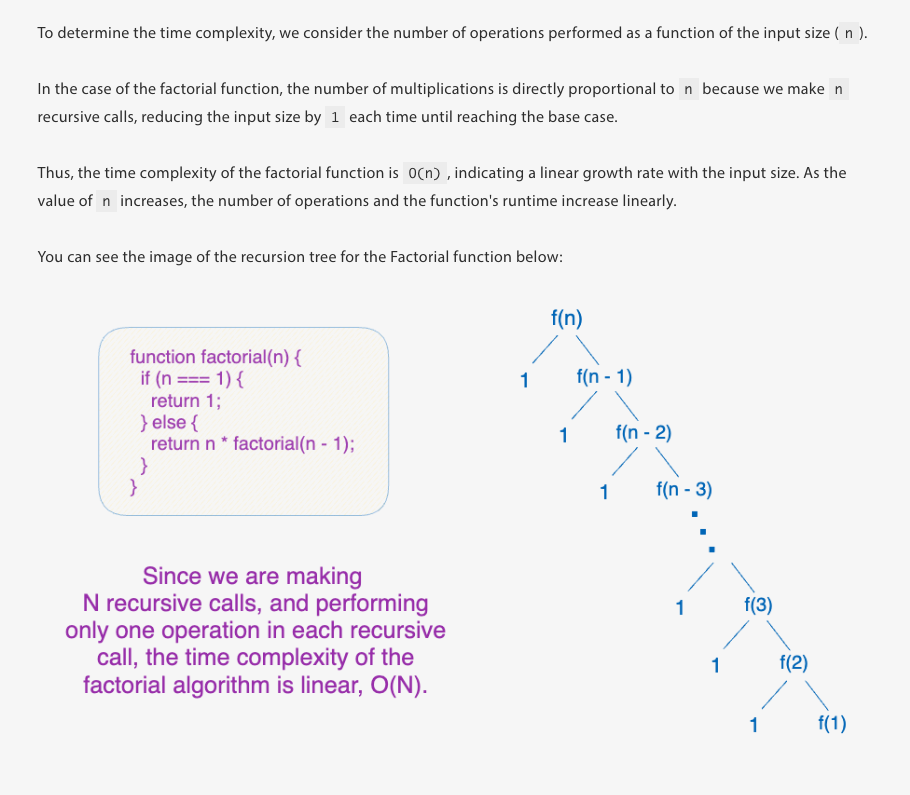
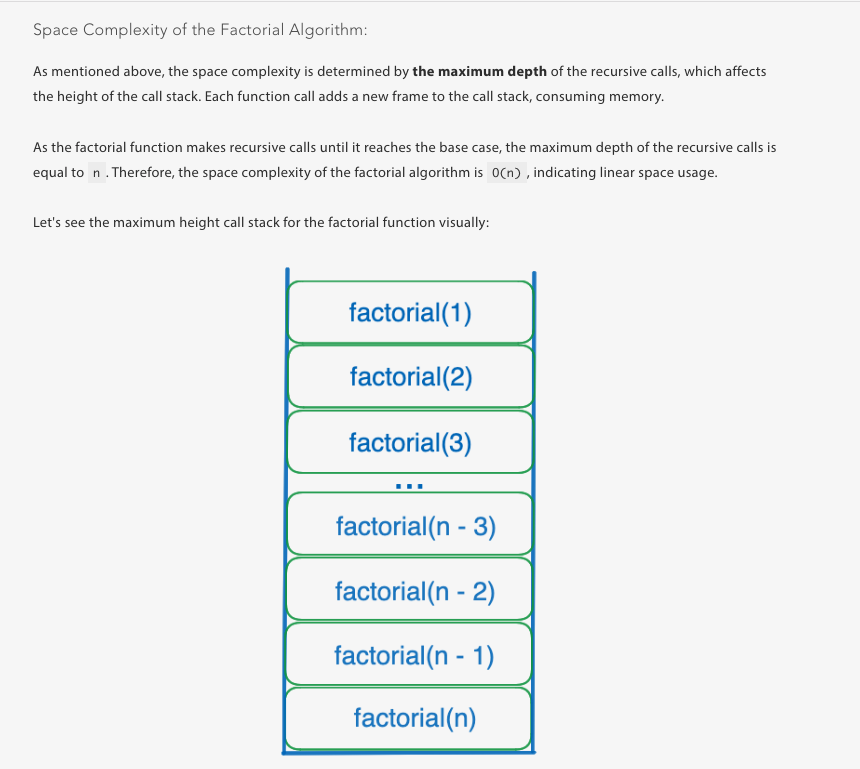

# data-structures-and-algorithms

Scrimba course: https://scrimba.com/data-structures-and-algorithms-c0shn6ckdm

# Sorting & Searching algorithms

There are hundreds of searching and sorting algorithms. In this course we will focus on a small number of these that
are the most useful ones to know as a developer.

## Bubble sort

Algorithm: Bubble Sort
Input: array of numbers
Output: the array with the numbers sorted in place and in ascending order

Steps:

1.  Iterate n - 1 times:
2.  Iterate from the start of the array to the end of the unsorted numbers:
3.                   If the current number is greater than the one after it:
4.                     Swap the numbers. Bubble the greater number up.

```js
function bubbleSort(numbers) {
  for (let i = 0; i < numbers.length - 1; i++) {
    for (let j = 0; j < numbers.length - i - 1; j++) {
      if (numbers[j] > numbers[j + 1]) {
        const temp = numbers[j];
        numbers[j] = numbers[j + 1];
        numbers[j + 1] = temp;
      }
    }
  }
}

const numbers = [5, 3, 2, 4, 1];
bubbleSort(numbers);
console.log(numbers);
```

### Challenge:

What is the time and space complexity of this algorithm?

Time complexity:

- Nested for loop = `O(n^2)` ✅ Correct

Space complexity:

- numbers = O(1)
- numbers.length = O(n)
- temp = O(1)
  Which means the space complexity is O(n) ❌ Incorrect

ℹ️ I misinterpreted the space complexity calculations. We are not using any memory space beyond the two loop variables i & j, therefore
the space complexity is `O(1)`.

### Additional reading

- [Geek for geeks](https://www.geeksforgeeks.org/dsa/bubble-sort-algorithm/)

"Bubble Sort is the simplest sorting algorithm that works by repeatedly swapping the adjacent elements if they are in the wrong order. This algorithm is not efficient for large data sets as its average and worst-case time complexity are quite high."

_Advantages of Bubble Sort:_

- Bubble sort is easy to understand and implement.
- It does not require any additional memory space.
- It is a stable sorting algorithm, meaning that elements with the same key value maintain their relative order in the sorted output.

_Disadvantages of Bubble Sort:_

- Bubble sort has a time complexity of O(n2) which makes it _very slow_ for large data sets.
- Bubble sort has almost no or limited real world applications. It is mostly used in academics to teach different ways of sorting.

## Recursion

> When a function calls itself

Here is an example of a recursive function using a factorial algorithm:

Algorithm: Factorial
Input: a number, n
Output: the factorial of n, n!

Steps:

1. If n is 0:
2. return 1
3. Return n _ factorial(n - 1)
   _/

### Challenge:

Implement the factorial algorithm above:

```js
function factorial(n) {
  //Base
  if (n === 0 || n === 1) return 1;
  return n * factorial(n - 1); //Recursion where the function calls itself
}
```

Every time a recursive function calls itself it takes up memory space in the call stack, as such the chain of recursive calls take up a lot of memory space which impacts space complexity.

Read more: https://launchschool.com/books/advanced_dsa/read/time_and_space_complexity_recursive





## Merge sort

> A fast sorting algorithm with a time complexity of O(n log n), which is a huge improvement over O(n^2).
