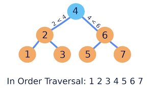

# data-structures-and-algorithms

Scrimba course: https://scrimba.com/data-structures-and-algorithms-c0shn6ckdm

# Trees

A hierarchical tree structure consisting of a set of connected nodes.

Each node has a `parent node` and one or more `child nodes`, except for:

- The `root` node which has no parent
- The `leaf` nodes which have no children

Applications:

1. File system directory structure
2. DOM tree of HTML documents
3. Search trees

## Binary Search Trees (BST)

Average search operation: O(log n) with n being the number of nodes in the tree.

These trees have a very specific pattern. Note how in the below image:

- The `left` side is always `less` that the parent
- The `right` side is always `more` than the parent



Here is an example of inserting a new value into a tree:

```js
export function insert(root, value) {
  if (root === null) {
    root = new Node(value);
  } else if (value < root.value) {
    root.left = insert(root.left, value);
  } else if (value > root.value) {
    root.right = insert(root.right, value);
  }
  return root;
}
```
